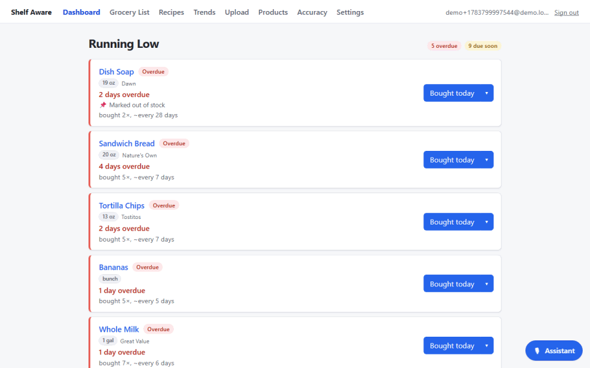
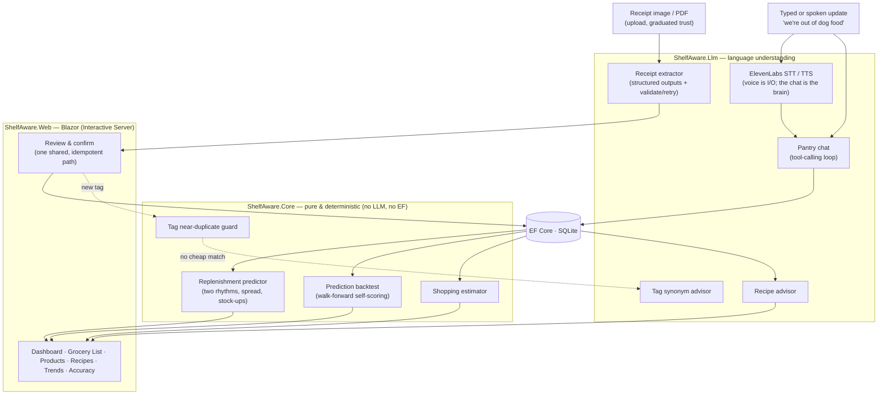

# Shelf Aware

**A pantry tracker that answers one question: _"What am I about to run out of?"_**

Snap (or just save) your grocery receipt. Shelf Aware reads it, learns how often you buy each
thing, and tells you what's about to run out — before you're standing in the kitchen realizing
there's no coffee.

[](https://github.com/Jcurran-Repo/ShelfAware/actions/workflows/ci.yml)
&nbsp; [](LICENSE)
&nbsp;·&nbsp; .NET 10 · Blazor · EF Core/SQLite · Anthropic Claude · ElevenLabs voice

> **Live demo:** _coming soon_ — `<!-- LIVE_DEMO_URL -->` (Azure App Service; one-line swap once deployed)



---

## How we actually use it

I built this for my wife and me, so it's shaped around a real weekly rhythm, not a feature list:

**Receipts mostly confirm themselves.** Photograph a stack of paper receipts (or upload order
screenshots and print-to-PDFs — several at once is fine, each reads as its own receipt). Trust is
graduated: a receipt is recorded automatically only when every line matches something we already
buy — anything new or uncertain waits in a quick review queue where I can fix it first. Nothing
enters history until it's either confirmed by me or confidently matched to products I've
confirmed before. And mistakes aren't permanent: removing a receipt takes everything it recorded
with it — its purchases, any products it introduced that never gathered other history, the
merchant matches it taught — so an accidental double-upload is one click to undo, not a
permanently skewed cadence.

**It quietly learns our rhythm — two of them.** How often we *rebuy* a thing, and how long one
*lasts* before we say "we're out". After a couple of trips it knows milk is ~every five days and
dog food ~every three weeks. It also knows its own confidence: a metronomic item gets a tight
warning window, a noisy one warns earlier — and buying three bags instead of one pushes the
reminder out to match. No setup forms. Just the receipts.

**The dashboard tells me what's low.** Not a giant inventory screen — the handful of things
overdue or about to be. That restraint *is* the app.

**I talk to it — literally.** Type *"we're out of dog food, almost out of coffee"* into the box,
or hold the mic button and say it. There's a hands-free conversation mode for multi-turn updates
(*"what am I low on?" → "add the first two"*).

**And it cooks with me.** Hit **Cook-along** on a saved recipe and it reads a step, then waits.
Say *"next"*, *"back"*, *"repeat"*, *"go to step 3"* — hands covered in flour, no screen. Ask it a
real question (*"can I use butter instead of oil?"*) and it answers, because behind the voice is the
same brain the rest of the app talks to; it knows which recipe you're on and which step you're
standing at. It measures your kitchen and your voice first, so it isn't guessing what counts as
speech in *your* room, or how long *you* pause mid-sentence.

**When it's time to shop,** the grocery list is already there — sorted by aisle, with the size and
brand we usually buy and a rough cost. The whole app installs to a phone's home screen, so the
list rides along to the store. Stuck on dinner? *"What can I make tonight?"* suggests
recipes from what's actually in the house and one-taps the missing bits onto the list.

**And I can see where the money's going** — spend by month, and how each item's price drifts.

**It's our pantry, not the internet's.** Everyone signs in, and everything — products, receipts,
recipes, settings — belongs to a *household*. My wife and I each have our own login and see the same
pantry (she joined with an invite code from Settings); anyone else who registers gets a completely
separate one. A deployment can also close sign-ups with one config flag and stay invite-only.
And because it's your data, Settings will hand you all of it as a JSON download — or delete every
trace — any time.

---

## The idea behind it

One rule runs through the whole codebase:

> **Use an LLM where language understanding is genuinely required. Use plain, testable code
> everywhere else.**

Reading a crumpled receipt is a language problem — a great fit for an LLM. Predicting when you'll
run out of milk is *arithmetic* — medians over purchase gaps. So that's plain C# with unit tests:
no API call, no token cost, same answer every time.

| Job | Who does it |
|---|---|
| Read a messy receipt into structured items | **LLM** |
| Understand *"we're out of dog food, low on coffee"* | **LLM** (tool calling) |
| Match a receipt line to a product you already have | **LLM-assisted** |
| Decide if a new tag means the same as an old one (Soda ≈ Soft Drink) | **LLM** |
| Turn speech into text, read replies aloud | **ElevenLabs** (pure I/O — the same chat brain decides) |
| Answer *"can I use butter instead of oil?"* mid-recipe | **LLM** (tool calling, with the recipe in view) |
| Hear *"next"* while you're cooking | **plain C#** — see below |
| Predict run-out dates | **plain C#** |
| Decide which imports are trustworthy enough to auto-confirm | **plain C#** |
| Catch a duplicate tag (casing / plural / typo) | **plain C#** |
| Sort the list by aisle, estimate cost | **plain C#** |
| Score its own predictions against history | **plain C#** |

The prediction engine — the thing the app is *named for* — contains **zero** LLM calls. It's pure,
deterministic, unit-tested, and (see below) it grades itself.

### I built the cook-along twice

The first version handed the whole conversation to ElevenLabs' realtime agent. It worked. It also
billed per minute of conversation — including the silence while you chop — put a load-bearing prompt
in a vendor dashboard where git couldn't see it, and ran its reasoning on a model I hadn't chosen.

So I built my own out of the parts I already had: their speech-to-text, their text-to-speech, and my
brain in the middle. Then I measured both — and the surprise is that **mine is faster on the turns
that matter**. "next" is the overwhelmingly common thing you say to a recipe, and here it costs a
string comparison and an already-cached clip: no model call, no round-trip, no meter. The realtime
agent round-trips an LLM to work out that "next" means next.

The interesting part is what that plain-code grammar is *allowed* to be. At first a miss was **wrong**
— say it oddly, or cough halfway through, and the model would helpfully *answer* your command instead
of obeying it. That made the phrase list load-bearing, and no list survives contact with how people
actually talk. So the model got a tool that moves the reader. Now a miss is merely **slow**: the
grammar became an optimisation rather than a gate, and it's free to be incomplete.

Both are still there. The realtime agent is one click away under the caret, because interrupting
mid-sentence is the one thing my loop genuinely can't do — it listens *between* steps, which is where
a cook actually talks, and which is why it needs no echo cancellation to hear "stop" over its own
voice. Different tools, honest trade, and the cheap one is the default.

### How it's wired



Three projects, one clean rule: **`Web → Core ← Llm`**. `Core` holds the domain, the prediction
engine, and the interfaces (`IReceiptExtractor`, `IPantryChat`, `ISpeechToText`, …)
— and has no dependency on any AI SDK or on EF Core. That seam is what makes the engine testable
without API calls, the whole AI layer testable through a faked `IChatClient`, and every provider a
DI swap.

---

## Does it actually work? Both halves are measured.

### Reading receipts

The extractor is scored against hand-labeled fixtures built from **real Walmart receipts**
(`tests/ShelfAware.Evals`); the `/accuracy` page renders the latest run.

| Metric | Result | Target |
|---|---:|---:|
| Line **recall** (items found) | **100%** | ≥ 90% |
| Line **precision** | **100%** | ≥ 90% |
| **Field accuracy** (quantity + category on matched lines) | **99%** | ≥ 85% |

<sub>4 real Walmart receipts · 160 hand-labeled line items · model `claude-haiku-4-5-20251001`. The receipt files are private (gitignored); only the labels and results are committed.</sub>

<!-- TODO: screenshot of the /accuracy page → docs/accuracy.png -->

**The honest part:** the first run read **58% recall** — and the flaw turned out to be the
*metric*, not the extraction. Symmetric Jaccard was punishing valid descriptor-word differences
("Lean Ground Beef" vs "All Natural 93% Lean Ground Beef"); a token containment coefficient — and a
hand-audit of all 83 pairings — gave a number that reflects reality. A good eval catches things,
including its own blind spots. The metric needed a second fix later: extraction wobbles between
singular and plural names run to run ("Lime" vs "Limes"), which containment scored as whole missed
lines until the tokenizer learned to fold bare plurals. The eval also caught a real behavior bug —
digital-order lines marked **Unavailable** (never delivered or charged) were being extracted as
purchases; the prompt now skips them, pinned by the largest fixture (77 lines).

### Predicting run-outs

The prediction engine backtests **itself**, live on `/accuracy`: every repurchase in our real
history is re-predicted using only the trips *before* it (walk-forward, no peeking), then scored
against the date we actually bought again. No API key, nothing to pre-generate — the numbers
update as receipts land.

Second honest part: with only ~a month of history the current numbers are modest (as of early July
2026: median error ~11 days; ~29% of predictions within ±2 days — most products have just 3–4
trips, and medians need data). That's the point of measuring: the dashboard's claims and the
engine's actual skill are the same number on the same page, and I get to watch it improve instead
of assuming it.

---

## A few design calls I'm happy with

- **Trust is graduated, not binary.** Smart confirm records only what it can vouch for — a learned
  alias or a confident match to a product we already buy — and queues the rest for human eyes. And
  a machine-made match can never become a sticky merchant alias; only human-reviewed pairings teach
  the matcher. Attention goes exactly where the pipeline is unsure. (This started life on a
  folder-watching auto-importer; when uploads superseded the folder, the feature was retired and
  its trust logic moved to the upload path — deleting an arbitrary-path filesystem read the server
  no longer needs to carry.)
- **Products are brand-agnostic; brand and size ride along on each purchase.** Milk is milk whether
  it's the store-brand gallon or a name-brand half-gallon — one product, one cadence, and the app
  recommends the one size you actually buy most.
- **Predictions carry their own uncertainty.** The warning window widens with the cadence's real
  variance (IQR), run-out estimates round *down* and buy-quantities round *up* ("stay ahead"), and
  a stock-up stretches the projection instead of nagging on the usual rhythm.
- **Two layers of category.** A single **store-aisle** orders the shopping trip; free-form **tags**
  power a browsable cloud — kept clean by a two-stage dedup (instant string check first, LLM synonym
  check only when that finds nothing).
- **Recipes from what you have.** The LLM does the semantic ingredient↔product match *once*, at
  save time; the "can I make this tonight?" check is plain code forever after.

---

## Run it locally

```bash
git clone https://github.com/Jcurran-Repo/ShelfAware && cd ShelfAware

# Anthropic API key — stored in user-secrets, never committed
dotnet user-secrets --project src/ShelfAware.Web set "Llm:ApiKey" "sk-ant-..."

# Optional — voice (push-to-talk, conversation, cook-along). One key does all of it;
# the realtime-agent option additionally wants ElevenLabs:AgentId, and nothing else does.
dotnet user-secrets --project src/ShelfAware.Web set "ElevenLabs:ApiKey" "..."

# Run (creates the SQLite DBs under src/ShelfAware.Web/app-data on first launch)
dotnet run --project src/ShelfAware.Web
# → open the printed http://localhost:<port>, create your account (that makes your household),
#   then upload a receipt at /receipt. A partner joins your household with the invite code
#   shown in Settings.
```

> **Upgrading from a pre-accounts version?** v3 changed the database schema (everything is
> per-household now) with no in-place upgrade: delete `app-data/shelfaware.db*` and let your
> receipts re-import. The app refuses to start on an old file and tells you exactly this.

```bash
# All tests, no API key needed: the engine is pure, the AI layer runs on a faked IChatClient,
# and the persistence tests run on in-memory SQLite.
dotnet test

# Extraction eval (needs a live key; writes the /accuracy data)
#   PowerShell: $env:Llm__ApiKey = "sk-ant-..."
dotnet run --project tests/ShelfAware.Evals -- \
  tests/ShelfAware.Evals/fixtures src/ShelfAware.Web/wwwroot/eval-results.json
```

Without any keys the app still runs — extraction and voice fail soft, and everything built on
existing data (dashboard, prediction, backtest, grocery list, tags) keeps working.

---

## Whose keys? (running it for other people)

Everything above is the simple case: your server, your keys (user-secrets, server-wide, shared by
the household). The moment other people can reach a deployment, `Llm:KeyMode` decides whose keys
do the work:

**`byok` — visitors bring their own.** The deployment ships **no usable keys**. Each visitor opens
**Settings → AI provider & keys**, picks Anthropic, OpenAI, or a local OpenAI-compatible server
(Ollama, LM Studio, llama.cpp — self-hosted runs only), pastes a key, and can tweak which model
does which job (receipt-reading needs vision; the assistant needs tool calling). An ElevenLabs key
switches on voice the same way — the agent id is only for the realtime-agent option, which is the
one thing here billed per minute. This is how the live demo will run — I'm not paying for the
internet's tokens, and nobody has to trust me with theirs.

**`managed` — the host's keys, on a meter.** The server's keys are authoritative, the key panel
disappears from Settings, and each household gets a daily allowance — `Llm:DailyCallLimit`,
`Llm:DailyTokenLimit`, `ElevenLabs:DailySignedUrlLimit` (unset = unlimited, the self-host
default). Settings shows every household its own usage for the day.

Leave `KeyMode` unset and it guesses right: server key configured → managed, none → BYOK.

**Where a visitor's key actually lives** — the honest part, because "bring your own key" deserves
some skepticism: it stays in the browser (localStorage, or session-only with the *"forget my keys
when I close this tab"* toggle) and is never written to a database or a log. It does ride each
request to the server, which holds it in memory just long enough to make the LLM call — that's
inherent to any server-side app, not a design slip. Backing that up: a strict
Content-Security-Policy (`script-src 'self'` plus one pinned SDK host — the real defense against a
rogue script reading localStorage), per-visitor key isolation, HTTPS/HSTS, rate-limited endpoints,
and a **Forget my keys** button that wipes everything. And the source is all right here — don't
take my word for it.

---

## Project layout

```
ShelfAware.slnx
  src/ShelfAware.Web/        Blazor app — pages, review/confirm, upload smart-confirm, DI, EF DbContext
  src/ShelfAware.Core/       Domain, prediction engine + backtest, interfaces  (no LLM, no EF)
  src/ShelfAware.Llm/        Receipt extractor · pantry chat · tag + recipe advisors · ElevenLabs voice · prompts
  tests/ShelfAware.Tests/    xUnit — prediction engine, backtest, estimator, tag dedup  (pure)
  tests/ShelfAware.Llm.Tests/xUnit — tool loop, extractor retry, speech services (faked clients)
  tests/ShelfAware.Web.Tests/xUnit — confirmation + import persistence (real EF on in-memory SQLite)
  tests/ShelfAware.Evals/    Console harness scoring extraction vs hand-labeled fixtures
  DESIGN.md                  The spec (rules, data model, phases)
  CLAUDE.md                  Build state, decisions, environment notes
```

## What's next

Up next is the **cloud deploy** (SQLite on a small VM) — the live-demo link at the top is a
one-line swap once it's live. After that: more eval fixtures beyond one merchant, and
password-reset emails (there's no mail server behind it yet — Settings admits as much).

## License

**Shelf Aware is source-available, not open source** — a deliberate distinction. It's under the
[PolyForm Noncommercial License 1.0.0](LICENSE): use it, self-host it, fork it, and tinker freely
for any **noncommercial** purpose — for yourself, your household, a school class, a non-profit,
even a government agency (the license's noncommercial-organization carve-outs apply regardless of
how those orgs are funded). The one thing you can't do is use it commercially, and that explicitly
includes running it as a paid or ad-supported hosted service. Those rights stay with me — if you'd
like a commercial license, open an issue and we'll talk.

Housekeeping: if you redistribute it, keep the `Required Notice:` line from [LICENSE](LICENSE)
intact — that's the license's one preservation rule. The license covers Shelf Aware's own code;
third-party components (the vendored audio worklets in `src/ShelfAware.Web/wwwroot/js/vendor` and
the NuGet dependencies) stay under their own licenses — see
[THIRD-PARTY-NOTICES.md](THIRD-PARTY-NOTICES.md). Contributions are welcome under the terms in
[CONTRIBUTING.md](CONTRIBUTING.md). <sub>SPDX: `PolyForm-Noncommercial-1.0.0`</sub>

---

<sub>Built as a portfolio piece — real users (us), real receipts, and real accuracy numbers for
*both* the LLM half and the statistics half. The full spec and decision log live in
[DESIGN.md](DESIGN.md) and [CLAUDE.md](CLAUDE.md).</sub>
