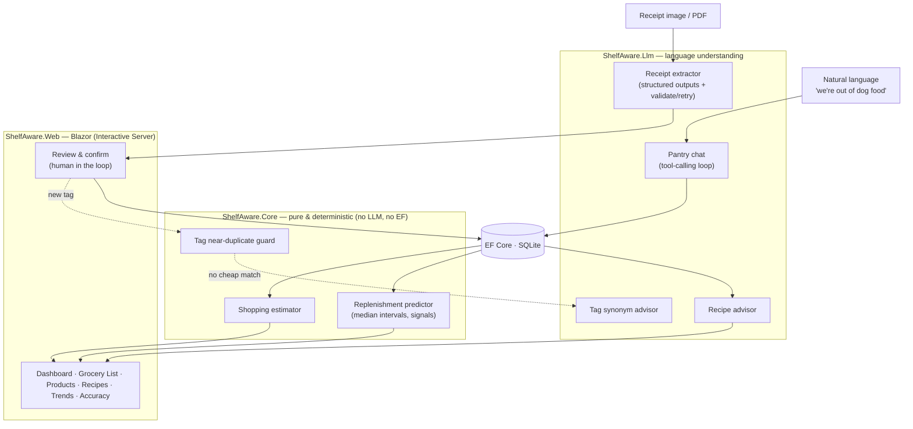

# Shelf Aware

**A pantry tracker that answers one question: _"What am I about to run out of?"_**

You take a photo of your grocery receipt. Shelf Aware reads it, learns how often you buy each
thing, and tells you what's about to run out — before you're standing in the kitchen realizing
there's no coffee.

[](https://github.com/Jcurran-Repo/ShelfAware/actions/workflows/ci.yml)
&nbsp;·&nbsp; .NET 10 · Blazor · EF Core/SQLite · Anthropic Claude

> **Live demo:** _coming soon_ — `<!-- LIVE_DEMO_URL -->` (Azure App Service; one-line swap once deployed)

<!-- TODO: drop a short screen capture here → docs/demo.gif -->
<!--  -->

---

## How I actually use it

I built this for my wife and me, so it's shaped around a real weekly rhythm, not a feature list:

**After a grocery run, I snap the receipt.** Paper, a Walmart order screenshot, a print-to-PDF —
whatever I've got. Shelf Aware pulls out the line items, expands the cryptic ones
(`GV WHL MLK 1GAL` → "Whole Milk"), and hands me a review table. I skim it, fix anything that looks
off, and hit confirm. Nothing is saved until I do.

**It quietly learns our rhythm.** After a couple of trips it knows we go through milk about every
five days and dog food about every three weeks. No setup, no "enter your household size" form — just
the receipts.

**The dashboard tells me what's low.** Not a giant inventory screen — just the handful of things
that are overdue or about to be. That restraint *is* the app: the running-low list is the whole point.

**I talk to it in plain English.** There's a box on the dashboard. I type
*"we're out of dog food, almost out of coffee, and I restocked paper towels,"* and it figures out
which products I mean and updates all three at once.

**When it's time to shop,** the grocery list is already there — sorted by aisle, with the size and
brand I usually buy and a rough cost. If I'm stuck on dinner I can ask *"what can I make tonight?"*
and it suggests recipes from what's actually in the house, then one-taps the missing bits onto the list.

**And I can see where the money's going** — spend by month, and how each item's price is drifting
over time.

---

## The idea behind it

One rule runs through the whole codebase:

> **Use an LLM where language understanding is genuinely required. Use plain, testable code
> everywhere else.**

Reading a crumpled receipt is a language problem — a great fit for an LLM. But predicting when you'll
run out of milk is just *arithmetic*: the median gap between purchases. So that's plain C# with unit
tests — no API call, no token cost, and it gives the same answer every time.

| Job | Who does it |
|---|---|
| Read a messy receipt into structured items | **LLM** |
| Understand *"we're out of dog food, low on coffee"* | **LLM** (tool calling) |
| Match a receipt line to a product you already have | **LLM-assisted** |
| Decide if a new tag means the same as an old one (Soda ≈ Soft Drink) | **LLM** |
| Predict run-out dates | **plain C#** |
| Catch a duplicate tag (casing / plural / typo) | **plain C#** |
| Sort the list by aisle, estimate cost | **plain C#** |

The prediction engine — the thing the app is *named for* — contains **zero** LLM calls. It's pure,
deterministic, and unit-tested.

### How it's wired



Three projects, one clean rule: **`Web → Core ← Llm`**. `Core` holds the domain, the prediction
engine, and the interfaces (`IReceiptExtractor`, `IPantryChat`, `ITagAdvisor`, `IRecipeAdvisor`) — and
has no dependency on the LLM SDK or on EF Core. That seam is what makes the engine testable without API
calls and the provider swappable.

---

## Does the receipt reading actually work?

Yes — and I measured it instead of taking my own word for it. The extractor is scored against
hand-labeled fixtures built from **real Walmart receipts** (`tests/ShelfAware.Evals`); the `/accuracy`
page renders the latest run live.

| Metric | Result | Target |
|---|---:|---:|
| Line **recall** (items found) | **99%** | ≥ 90% |
| Line **precision** | **99%** | ≥ 90% |
| **Field accuracy** (quantity + category on matched lines) | **100%** | ≥ 85% |

<sub>3 real Walmart receipts · 83 hand-labeled line items · model `claude-haiku-4-5-20251001`. The receipt files are private (gitignored); only the labels and results are committed.</sub>

<!-- TODO: screenshot of the /accuracy page → docs/accuracy.png -->

**The honest part:** the first run read **58% recall** and I nearly panicked — until the verbose
diagnostic showed every "miss" was the *same item worded differently* ("Lean Ground Beef" vs "All
Natural 93% Lean Ground Beef"). The flaw was the *metric*, not the extraction: symmetric Jaccard was
punishing perfectly valid descriptor words. Switching to a token **containment coefficient** — and then
hand-auditing all 83 pairings — gave a number that reflects reality. A good eval catches things,
including its own blind spots.

---

## A few design calls I'm happy with

- **Products are brand-agnostic; brand and size ride along on each purchase.** Milk is milk whether
  it's the store-brand gallon or a name-brand half-gallon — it all rolls up into one product, and the
  app recommends the one size you actually buy most (never "buy a gallon *and* a half-gallon").
- **Two layers of category.** A single **store-aisle** per product orders your shopping trip; free-form
  **tags** (Condiment, Canned, Pet Treats…) power a clickable cloud for browsing. A two-stage dedup —
  instant string check first, LLM synonym check *only when that finds nothing* — keeps the tags from
  fragmenting six months in.
- **"Stay ahead" rounding.** Run-out predictions round *down* and buy-quantities round *up*: remind me
  early, buy enough.
- **Spend insight, pulled forward on purpose.** I'd scoped price/spend tracking *out* to protect the
  timebox — then realized every confirmed receipt was already handing me the price data. It was nearly
  free to add and I genuinely wanted it, so I pulled it forward: monthly spend, a next-month forecast,
  and per-item price drift. Kept deliberately bounded — it's insight, not a budgeting app.
- **Recipes from what you have.** Ask in plain English, get ideas grounded in what's actually on hand,
  save the ones you like, and one-tap the missing ingredients onto the grocery list. The LLM does the
  semantic ingredient↔product match *once*, at save time; the "can I make this tonight?" check is plain
  code after that.

---

## Run it locally

```bash
git clone https://github.com/Jcurran-Repo/ShelfAware && cd ShelfAware

# Anthropic API key — stored in user-secrets, never committed
dotnet user-secrets --project src/ShelfAware.Web set "Llm:ApiKey" "sk-ant-..."

# Run (creates the SQLite DB under src/ShelfAware.Web/app-data on first launch)
dotnet run --project src/ShelfAware.Web
# → open the printed http://localhost:<port>, then upload a receipt at /receipt
```

```bash
# Unit tests (no API key needed — the engine is pure)
dotnet test tests/ShelfAware.Tests

# Extraction eval (needs a live key; writes the /accuracy data)
#   PowerShell: $env:Llm__ApiKey = "sk-ant-..."
dotnet run --project tests/ShelfAware.Evals -- \
  tests/ShelfAware.Evals/fixtures src/ShelfAware.Web/wwwroot/eval-results.json
```

Without an API key the app still runs — uploads just fail gracefully, and everything built on
existing data (dashboard, prediction, grocery list, tags) keeps working.

---

## Project layout

```
ShelfAware.slnx
  src/ShelfAware.Web/      Blazor app — pages, review/confirm UI, DI, EF DbContext
  src/ShelfAware.Core/     Domain, prediction engine, interfaces, tag logic  (no LLM, no EF)
  src/ShelfAware.Llm/      Receipt extractor · pantry chat · tag + recipe advisors · prompts
  tests/ShelfAware.Tests/  xUnit — prediction engine, estimator, tag dedup, size/format
  tests/ShelfAware.Evals/  Console harness scoring extraction vs hand-labeled fixtures
  DESIGN.md                The spec (rules, data model, phases)
  CLAUDE.md                Build state, decisions, environment notes
```

## What's next

Feature-complete and verified end to end in the browser. Up next is an **Azure deploy** (SQLite under
`/home/data`) — the live-demo link at the top is a one-line swap once it's live. On the backlog: a CSV
importer to bulk-load months of past orders with plain code (no LLM needed for already-structured data),
and a per-size price trend.

---

<sub>Built as a portfolio piece — real users (us), real receipts, real accuracy numbers. The full spec
and decision log live in [DESIGN.md](DESIGN.md) and [CLAUDE.md](CLAUDE.md).</sub>
