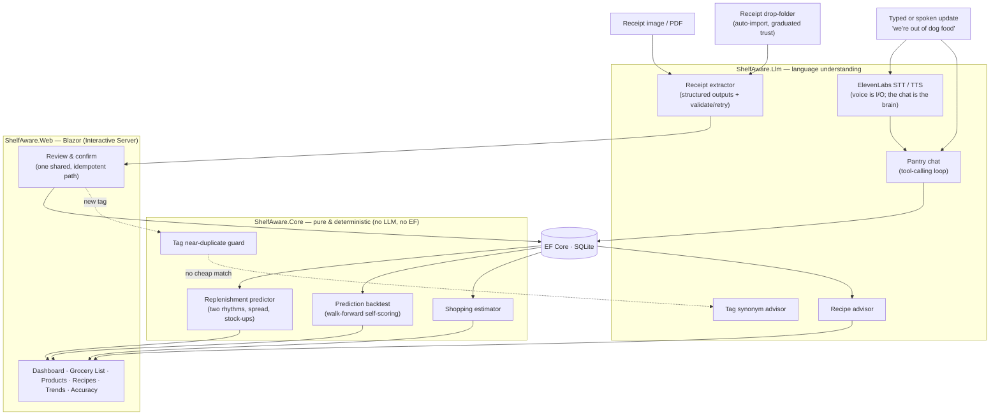

# Shelf Aware

**A pantry tracker that answers one question: _"What am I about to run out of?"_**

Snap (or just save) your grocery receipt. Shelf Aware reads it, learns how often you buy each
thing, and tells you what's about to run out — before you're standing in the kitchen realizing
there's no coffee.

[](https://github.com/Jcurran-Repo/ShelfAware/actions/workflows/ci.yml)
&nbsp;·&nbsp; .NET 10 · Blazor · EF Core/SQLite · Anthropic Claude · ElevenLabs voice

> **Live demo:** _coming soon_ — `<!-- LIVE_DEMO_URL -->` (Azure App Service; one-line swap once deployed)

<!-- TODO: drop a short screen capture here → docs/demo.gif -->
<!--  -->

---

## How we actually use it

I built this for my wife and me, so it's shaped around a real weekly rhythm, not a feature list:

**Receipts mostly import themselves.** Order screenshots and print-to-PDFs land in a folder;
Shelf Aware picks up new ones on its own (or when I say *"import my receipts"*). Trust is
graduated: a receipt is recorded automatically only when every line matches something we already
buy — anything new or uncertain waits in a quick review queue where I can fix it first. Manual
upload still works the same way: photo in, editable review table out, nothing recorded until it's
either confirmed by me or confidently matched to products I've confirmed before.

**It quietly learns our rhythm — two of them.** How often we *rebuy* a thing, and how long one
*lasts* before we say "we're out". After a couple of trips it knows milk is ~every five days and
dog food ~every three weeks. It also knows its own confidence: a metronomic item gets a tight
warning window, a noisy one warns earlier — and buying three bags instead of one pushes the
reminder out to match. No setup forms. Just the receipts.

**The dashboard tells me what's low.** Not a giant inventory screen — the handful of things
overdue or about to be. That restraint *is* the app.

**I talk to it — literally.** Type *"we're out of dog food, almost out of coffee"* into the box,
or hold the mic button and say it. There's a hands-free conversation mode for multi-turn updates
(*"what am I low on?" → "add the first two"*), and saved recipes can read themselves aloud
step-by-step while you cook — including a barge-in cook-along that listens for "next" and "repeat"
while it talks.

**When it's time to shop,** the grocery list is already there — sorted by aisle, with the size and
brand we usually buy and a rough cost. Stuck on dinner? *"What can I make tonight?"* suggests
recipes from what's actually in the house and one-taps the missing bits onto the list.

**And I can see where the money's going** — spend by month, and how each item's price drifts.

---

## The idea behind it

One rule runs through the whole codebase:

> **Use an LLM where language understanding is genuinely required. Use plain, testable code
> everywhere else.**

Reading a crumpled receipt is a language problem — a great fit for an LLM. Predicting when you'll
run out of milk is *arithmetic* — medians over purchase gaps. So that's plain C# with unit tests:
no API call, no token cost, same answer every time.

| Job | Who does it |
|---|---|
| Read a messy receipt into structured items | **LLM** |
| Understand *"we're out of dog food, low on coffee"* | **LLM** (tool calling) |
| Match a receipt line to a product you already have | **LLM-assisted** |
| Decide if a new tag means the same as an old one (Soda ≈ Soft Drink) | **LLM** |
| Turn speech into text, read replies aloud | **ElevenLabs** (pure I/O — the same chat brain decides) |
| Predict run-out dates | **plain C#** |
| Decide which imports are trustworthy enough to auto-confirm | **plain C#** |
| Catch a duplicate tag (casing / plural / typo) | **plain C#** |
| Sort the list by aisle, estimate cost | **plain C#** |
| Score its own predictions against history | **plain C#** |

The prediction engine — the thing the app is *named for* — contains **zero** LLM calls. It's pure,
deterministic, unit-tested, and (see below) it grades itself.

### How it's wired



Three projects, one clean rule: **`Web → Core ← Llm`**. `Core` holds the domain, the prediction
engine, and the interfaces (`IReceiptExtractor`, `IPantryChat`, `ISpeechToText`, `IReceiptInbox`, …)
— and has no dependency on any AI SDK or on EF Core. That seam is what makes the engine testable
without API calls, the whole AI layer testable through a faked `IChatClient`, and every provider a
DI swap.

---

## Does it actually work? Both halves are measured.

### Reading receipts

The extractor is scored against hand-labeled fixtures built from **real Walmart receipts**
(`tests/ShelfAware.Evals`); the `/accuracy` page renders the latest run.

| Metric | Result | Target |
|---|---:|---:|
| Line **recall** (items found) | **99%** | ≥ 90% |
| Line **precision** | **99%** | ≥ 90% |
| **Field accuracy** (quantity + category on matched lines) | **100%** | ≥ 85% |

<sub>3 real Walmart receipts · 83 hand-labeled line items · model `claude-haiku-4-5-20251001`. The receipt files are private (gitignored); only the labels and results are committed.</sub>

<!-- TODO: screenshot of the /accuracy page → docs/accuracy.png -->

**The honest part:** the first run read **58% recall** — and the flaw turned out to be the
*metric*, not the extraction. Symmetric Jaccard was punishing valid descriptor-word differences
("Lean Ground Beef" vs "All Natural 93% Lean Ground Beef"); a token containment coefficient — and a
hand-audit of all 83 pairings — gave a number that reflects reality. A good eval catches things,
including its own blind spots.

### Predicting run-outs

The prediction engine backtests **itself**, live on `/accuracy`: every repurchase in our real
history is re-predicted using only the trips *before* it (walk-forward, no peeking), then scored
against the date we actually bought again. No API key, nothing to pre-generate — the numbers
update as receipts land.

Second honest part: with only ~a month of history the current numbers are modest (as of early July
2026: median error ~11 days; ~29% of predictions within ±2 days — most products have just 3–4
trips, and medians need data). That's the point of measuring: the dashboard's claims and the
engine's actual skill are the same number on the same page, and I get to watch it improve instead
of assuming it.

---

## A few design calls I'm happy with

- **Trust is graduated, not binary.** Auto-import confirms only what it can vouch for — a learned
  alias or a confident match to a product we already buy — and queues the rest for human eyes. And
  a machine-made match can never become a sticky merchant alias; only human-reviewed pairings teach
  the matcher. Attention goes exactly where the pipeline is unsure.
- **Products are brand-agnostic; brand and size ride along on each purchase.** Milk is milk whether
  it's the store-brand gallon or a name-brand half-gallon — one product, one cadence, and the app
  recommends the one size you actually buy most.
- **Predictions carry their own uncertainty.** The warning window widens with the cadence's real
  variance (IQR), run-out estimates round *down* and buy-quantities round *up* ("stay ahead"), and
  a stock-up stretches the projection instead of nagging on the usual rhythm.
- **Two layers of category.** A single **store-aisle** orders the shopping trip; free-form **tags**
  power a browsable cloud — kept clean by a two-stage dedup (instant string check first, LLM synonym
  check only when that finds nothing).
- **Recipes from what you have.** The LLM does the semantic ingredient↔product match *once*, at
  save time; the "can I make this tonight?" check is plain code forever after.

---

## Run it locally

```bash
git clone https://github.com/Jcurran-Repo/ShelfAware && cd ShelfAware

# Anthropic API key — stored in user-secrets, never committed
dotnet user-secrets --project src/ShelfAware.Web set "Llm:ApiKey" "sk-ant-..."

# Optional — voice (push-to-talk, conversation, recipe read-aloud):
dotnet user-secrets --project src/ShelfAware.Web set "ElevenLabs:ApiKey" "..."

# Run (creates the SQLite DB under src/ShelfAware.Web/app-data on first launch)
dotnet run --project src/ShelfAware.Web
# → open the printed http://localhost:<port>, then upload a receipt at /receipt
```

```bash
# All tests, no API key needed: the engine is pure, the AI layer runs on a faked IChatClient,
# and the persistence tests run on in-memory SQLite.
dotnet test

# Extraction eval (needs a live key; writes the /accuracy data)
#   PowerShell: $env:Llm__ApiKey = "sk-ant-..."
dotnet run --project tests/ShelfAware.Evals -- \
  tests/ShelfAware.Evals/fixtures src/ShelfAware.Web/wwwroot/eval-results.json
```

Without any keys the app still runs — extraction and voice fail soft, and everything built on
existing data (dashboard, prediction, backtest, grocery list, tags) keeps working.

---

## Project layout

```
ShelfAware.slnx
  src/ShelfAware.Web/        Blazor app — pages, review/confirm, auto-import, DI, EF DbContext
  src/ShelfAware.Core/       Domain, prediction engine + backtest, interfaces  (no LLM, no EF)
  src/ShelfAware.Llm/        Receipt extractor · pantry chat · tag + recipe advisors · ElevenLabs voice · prompts
  tests/ShelfAware.Tests/    xUnit — prediction engine, backtest, estimator, tag dedup  (pure)
  tests/ShelfAware.Llm.Tests/xUnit — tool loop, extractor retry, speech services (faked clients)
  tests/ShelfAware.Web.Tests/xUnit — confirmation + import persistence (real EF on in-memory SQLite)
  tests/ShelfAware.Evals/    Console harness scoring extraction vs hand-labeled fixtures
  DESIGN.md                  The spec (rules, data model, phases)
  CLAUDE.md                  Build state, decisions, environment notes
```

## What's next

Up next is the **Azure deploy** (SQLite under `/home/data`) — the live-demo link at the top is a
one-line swap once it's live. After that: a cloud/email receipt inbox (the `IReceiptInbox` seam is
already there), more eval fixtures beyond one merchant, and a per-size price trend.

---

<sub>Built as a portfolio piece — real users (us), real receipts, and real accuracy numbers for
*both* the LLM half and the statistics half. The full spec and decision log live in
[DESIGN.md](DESIGN.md) and [CLAUDE.md](CLAUDE.md).</sub>
