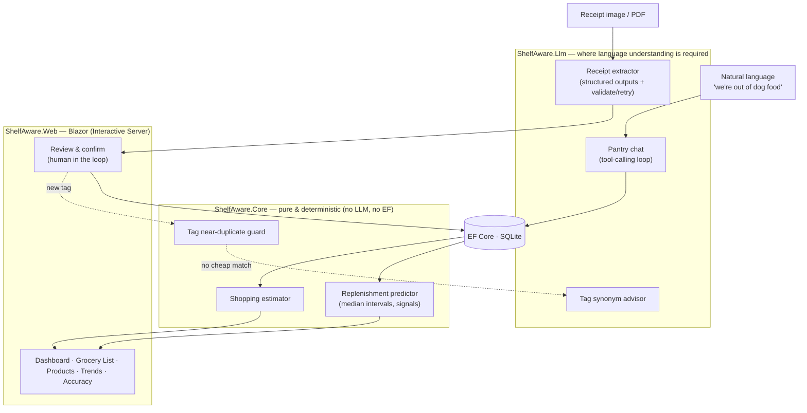

# Shelf Aware

**An LLM-powered pantry tracker that answers one question: _"What am I about to run out of?"_**

Photograph a grocery receipt → a language model reads and normalizes the messy line items →
a deterministic engine learns each product's rhythm and predicts run-out dates → your dashboard
tells you what to buy. Natural-language nudges ("we're out of dog food, almost out of coffee")
update state through tool calls.

[](https://github.com/Jcurran-Repo/ShelfAware/actions/workflows/ci.yml)
&nbsp;·&nbsp; .NET 10 · Blazor · EF Core/SQLite · Anthropic Claude

> **Live demo:** _coming soon_ — `<!-- LIVE_DEMO_URL -->` (Azure App Service; one-line swap once deployed)

<!-- TODO: drop a short screen capture here → docs/demo.gif -->
<!--  -->

---

## The thesis

> **Use an LLM where language understanding is genuinely required. Use plain, testable code everywhere else — because statistics and string logic suffice there, and they're cheaper, faster, and verifiable.**

This isn't a slogan bolted on afterward; it's the architecture. The split is deliberate and visible in the project boundaries:

| Job | Approach | Why |
|---|---|---|
| Parse a crumpled / verbose receipt into structured items | **LLM** | language understanding |
| Interpret *"we're out of dog food, low on coffee"* → actions | **LLM** (tool calling) | language understanding |
| Match a new receipt line to an existing product | **LLM-assisted** | semantic, fuzzy |
| Decide if a new tag is a synonym of an existing one (Soda ≈ Soft Drink) | **LLM** | semantic, no shared letters |
| Predict run-out dates from purchase history | **plain C#** (median intervals) | statistics suffice |
| Catch a duplicate tag (casing / plural / typo) | **plain C#** (string similarity) | suffices, instant, free |
| Order the grocery list by store aisle, estimate cost | **plain C#** | suffices |

The prediction engine — the thing the app is *named for* — contains **zero** LLM calls. It's pure, deterministic, and unit-tested.

---

## Architecture



Three projects, one clean dependency rule: **`Web → Core ← Llm`**. `Core` defines the domain, the
prediction engine, and the interfaces (`IReceiptExtractor`, `IPantryChat`, `ITagAdvisor`); it has no
dependency on the LLM SDK or EF Core. That seam is what makes the engine unit-testable without API
calls and the provider swappable.

---

## The core flow: extract → match → predict → chat

1. **Extract.** Upload a receipt (photo, digital-order screenshot, or print-to-PDF — multi-page is
   merged). The extractor calls Claude with a strict JSON schema (structured outputs, server-side
   enforced) plus a validate-and-retry-once guard in C#. It returns brand-stripped item names,
   per-purchase brand + size, quantity, a **store-aisle category**, and descriptive **tags**.
2. **Match (human in the loop).** A review screen pre-fills each line's product by trust order:
   learned alias → model suggestion → deterministic matcher → "create new." **Nothing is saved until
   you confirm**, so an extraction slip is caught, not silently persisted.
3. **Predict.** `ReplenishmentPredictor` (pure C#) collects distinct purchase dates, takes the
   **median** repurchase interval (robust to a stock-up outlier; trims >3× median once enough history
   exists), and projects a due date → **Overdue / Due soon / Stocked / Still learning**. Explicit
   signals ("out now", "restocked") override the statistics.
4. **Chat.** The dashboard's quick-update box runs a tool-calling loop — `record_signal`,
   `add_purchase`, `query_status`, `create_product` — resolving loose product references by fuzzy
   match and replying with a one-line confirmation.

### Notable design calls
- **Brand-agnostic products, size as metadata.** The same item bought across brands/sizes rolls up
  into one product; the predictor learns cadence from the *dominant* size and recommends one size to
  buy (never "buy a gallon *and* a half-gallon").
- **Two-layer categories.** A single **store-aisle** `Category` orders your shopping trip; many
  free-form **tags** (Condiment, Canned, Pet Treats, …) power a clickable tag cloud and filtering.
- **Two-stage tag dedup** keeps that cloud from fragmenting six months in: an instant plain-code
  near-duplicate check first, then an LLM synonym check *only when the cheap one finds nothing* — and
  the live tag vocabulary is fed back to the extractor so it reuses tags at the source.
- **"Stay ahead" rounding.** Predicted intervals round **down** and buy-quantities round **up** — the
  app errs toward reminding you early and buying enough.

---

## Accuracy — measured, not asserted

The extractor is scored against hand-labeled fixtures built from **real Walmart receipts** (`tests/ShelfAware.Evals`).
The `/accuracy` page renders the latest run live.

| Metric | Result | Target |
|---|---:|---:|
| Line **recall** (items found) | **99%** | ≥ 90% |
| Line **precision** | **99%** | ≥ 90% |
| **Field accuracy** (quantity + category on matched lines) | **100%** | ≥ 85% |

<sub>3 real Walmart receipts · 83 hand-labeled line items · model `claude-haiku-4-5-20251001`. Receipt files are private (gitignored); only the labels + results are committed.</sub>

<!-- TODO: screenshot of the /accuracy page → docs/accuracy.png -->

**An honest note on the methodology.** The first eval run read **58% recall** — alarming, until the
verbose diagnostic showed every "miss" was the *same item worded differently* ("Lean Ground Beef" vs
"All Natural 93% Lean Ground Beef"). The flaw was the **metric**, not the extraction: symmetric Jaccard
penalized valid descriptor-word differences. Switching to a token **containment coefficient** and then
**auditing all 83 pairings by hand** gave a number that reflects reality. The eval also surfaced real
category gaps (first-aid items, condiments), which drove a prompt refinement that lifted field accuracy
from 93% → 100%. The point of an eval is to *catch* things — including its own blind spots.

---

## Tech stack

| Layer | Choice |
|---|---|
| Runtime / UI | .NET 10 · Blazor (Interactive Server) |
| Data | EF Core + SQLite (single file; `EnsureCreated`, no migration drama) |
| LLM | Anthropic Messages API · `claude-haiku-4-5-20251001` (pinned, vision-capable) · structured outputs |
| Tests | xUnit (engine + helpers) · a console eval harness for extraction accuracy |
| CI | GitHub Actions — restore, build (Release), run the unit tests on every push/PR |

---

## Run it locally

```bash
git clone https://github.com/Jcurran-Repo/ShelfAware && cd ShelfAware

# Anthropic API key — stored in user-secrets, never committed
dotnet user-secrets --project src/ShelfAware.Web set "Llm:ApiKey" "sk-ant-..."

# Run (creates the SQLite DB under src/ShelfAware.Web/app-data on first launch)
dotnet run --project src/ShelfAware.Web
# → open the printed http://localhost:<port>, then upload a receipt at /receipt
```

```bash
# Unit tests (no API key needed — the engine is pure)
dotnet test tests/ShelfAware.Tests

# Extraction eval (needs a live key; writes the /accuracy data)
#   PowerShell: $env:Llm__ApiKey = "sk-ant-..."
dotnet run --project tests/ShelfAware.Evals -- \
  tests/ShelfAware.Evals/fixtures src/ShelfAware.Web/wwwroot/eval-results.json
```

Without an API key the app still runs — uploads simply fail gracefully (the prediction engine,
dashboard, and tag UI all work on existing data).

---

## Project layout

```
ShelfAware.slnx
  src/ShelfAware.Web/      Blazor app — pages, review/confirm UI, DI, EF DbContext
  src/ShelfAware.Core/     Domain, prediction engine, interfaces, tag logic  (no LLM, no EF)
  src/ShelfAware.Llm/      IReceiptExtractor / IPantryChat / ITagAdvisor impls + prompts
  tests/ShelfAware.Tests/  xUnit — prediction engine, estimator, tag dedup, size/format
  tests/ShelfAware.Evals/  Console harness scoring extraction vs hand-labeled fixtures
  DESIGN.md                The spec (rules, data model, phases)
  CLAUDE.md                Build state, decisions, environment notes
```

## Status & roadmap

Feature-complete and browser-verified end to end. **Up next:** Azure App Service deploy (SQLite under
`/home/data`) — the live-demo URL above is a one-line swap once it's up. On the backlog: a CSV history
importer (bulk-load months of orders via plain code — no LLM needed for already-structured data), and a
richer per-size price trend.

---

<sub>Built as a portfolio piece — real users, real receipts, real accuracy numbers. Design rationale and
the full decision log live in [DESIGN.md](DESIGN.md) and [CLAUDE.md](CLAUDE.md).</sub>
